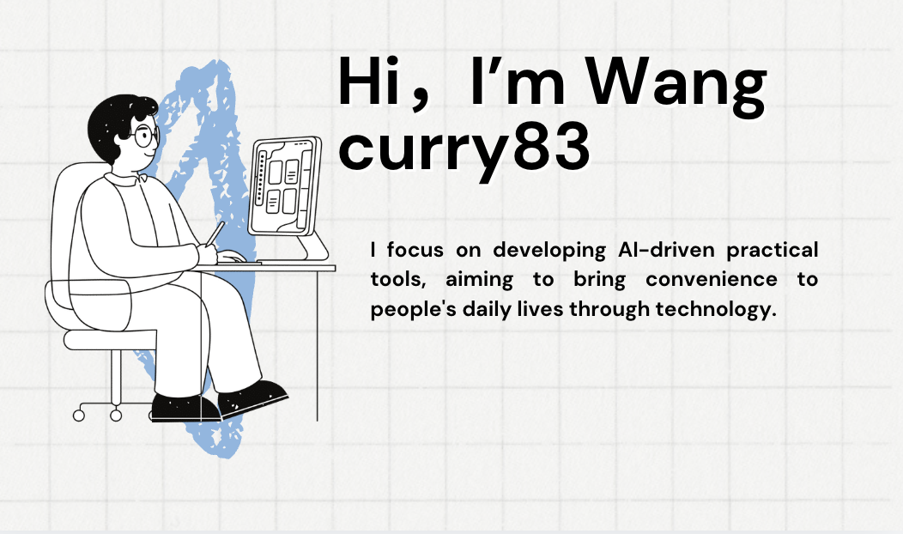

## Hi there 👋

<!--
**wl200203/wl200203** is a ✨ _special_ ✨ repository because its `README.md` (this file) appears on your GitHub profile.
**
Here are some ideas to get you started:

- 🔭 I’m currently working on ...
- 🌱 I’m currently learning ...
- 👯 I’m looking to collaborate on ...
- 🤔 I’m looking for help with ...
- 💬 Ask me about ...
- 📫 How to reach me: ...
- 😄 Pronouns: ...
- ⚡ Fun fact: ...
-->

- 🏃 Travel around the world. Discover the world, and discover myself.
- 💜 "One day in the future, I will be running a bookstore of my own."
- ⭐️ Passionate about programming and eager to create personalized software of my own.

<picture>
  <source media="(prefers-color-scheme: dark)" srcset="https://raw.githubusercontent.com/wl200203/wl200203/output/github-contribution-grid-snake-dark.svg">
  <source media="(prefers-color-scheme: light)" srcset="https://raw.githubusercontent.com/wl200203/wl200203/output/github-contribution-grid-snake.svg">
  
</picture>

  
## 💻 My Skill Set 

  
      

  
## 🔧 Tools 

<code></code>
<code></code>
<code></code>
 
<code></code>
<code></code>
<code></code>

  
## 💌 Contact 

  

<!-- https://github.com/anuraghazra/github-readme-stats -->

<!-- https://github.com/DenverCoder1/github-readme-streak-stats -->

 

You are my  visitor, Have a nice day! 😄

